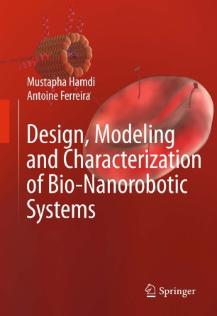
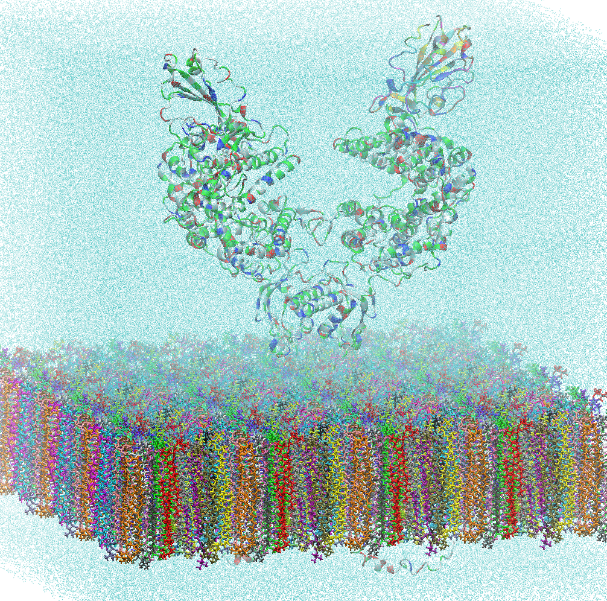

# Computational-BioNano-Design

# DeepSelect: Computational Bio-Nano Design & Molecular Analysis

This repository integrates my research on bio-nanorobotic systems modeling with advanced ML-driven molecular characterization. It serves as a bridge between biophysical theory and high-performance computing (HPC).

## 📖 Featured Work: Bio-Nanorobotic Systems
This project includes theoretical and computational models from my published work: 
**"Design, Modeling and Characterization of Bio-Nanorobotic Systems"**.
* **Authors:** Mustapha Hamdi, Antoine Ferreira
* **Publisher:** Springer
* **ISBN:** 978-90-481-3179-2
* **Official Link:** [Springer - Bio-Nanorobotic Systems](https://link.springer.com/book/10.1007/978-90-481-3180-8)

  

### Key Capabilities:
* **In-Silico Drug Discovery:** ML models for toxicity prediction and binding affinity.
* **Nano-Scale Dynamics:** Computational modeling of bio-nanosystems in complex biological environments.
* **GPU-Accelerated Simulations:** Leveraging NVIDIA architectures for multi-physics molecular simulations (MD/MM).

## 🔬 Molecular Dynamics & Biophysics
Characterization of multi-scale interactions between protein structures and lipid bilayers.

  

*Simulation of protein-membrane binding using GPU-accelerated molecular dynamics.*

### Advanced Toolchains & Methodologies:
* **Visualization & Analysis:** VMD (Visual Molecular Dynamics) for structural interpretation.
* **High-Throughput MD:** GROMACS and NAMDS for massively parallel molecular trajectories.
* **Molecular Mechanics:** Spartan Wavefunction for precise MM and DFT (Density Functional Theory) calculations.
* **AI Frameworks:** PyTorch for training deep learning models on chemical descriptors.

## 🔬 Computational Bio Expertise
* **Semantic Codon Segmentation:** Applying NLP techniques to biological sequences for predictive modeling.
* **Toxicity Prediction:** Neural networks trained on chemical descriptors for early-stage drug screening.
* **HPC Integration:** Optimizing simulation throughput using CUDA and NVIDIA BioNeMo-ready workflows.
